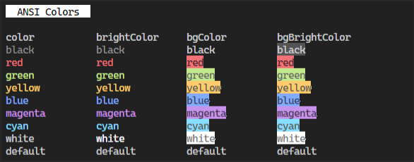
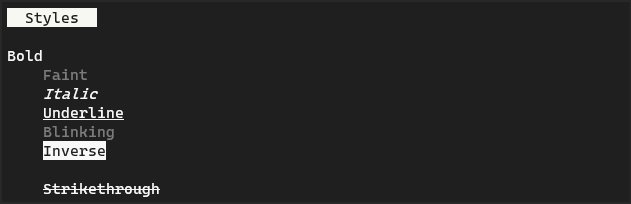
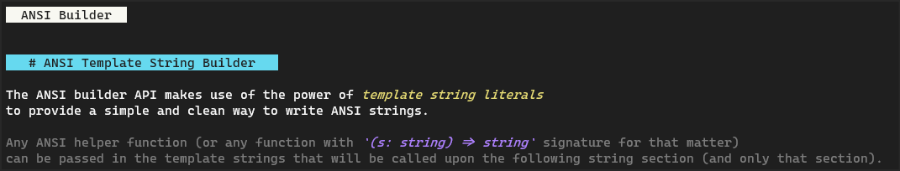
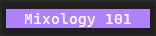
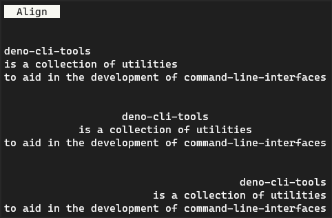
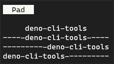
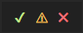

<h1>deno-cli-tools</h1>

<h2 align='center'>🚧 Work In Progress 🚧</h2>

---

Command-line tools and utilities for Deno 🦕 projects


<details>

<summary>Table of Contents</summary>

- [📦 ANSI Modules](#-ansi-modules)
  - [🎨 Colors](#-colors)
  - [💄 Styles](#-styles)
  - [🏗 ANSI Builder](#-ansi-builder)
  - [☝ Cursor](#-cursor)
  - [🧼 Clear](#-clear)
  - [RegEx](#regex)
  - [Mix](#mix)
- [📚 Helpers](#-helpers)
  - [🏭 Composition](#-composition)
  - [📄 Format](#-format)
    - [Align](#align)
    - [Pad](#pad)
- [📐 Components](#-components)
  - [Box](#box)
  - [Progress-Bars](#progress-bars)
  - [Spinners](#spinners)
- [✔ Symbols](#-symbols)
- [📑 License](#-license)

</details>

---

## 📦 ANSI Modules

### 🎨 Colors

The colors package allows you to style text with colors.

```ts
import { blue, red } from 'https://.../ansi/colors.ts'
console.log(blue('Whale'))
console.log(red('Skies'))
```

All colors have `bg`, `bright` and `bgBright` variants. e.g. to use bright yellow call `yellow.bright(text)` and to use blue background call `blue.bg(text)`

<div align='center'>
  
</div>

<br />

colors: `black` | `red` | `green` | `yellow` | `blue` | `magenta` | `cyan` | `white` | `default`

The `rgb` function colors a string with the given RGB value.

```ts
import { rgb } from 'https://.../ansi/colors.ts'
const clr = rgb([125, 224, 65])
console.log(clr('text'))
```

### 💄 Styles

The styles package allows you to format your text.

```ts
import { bold, inverse } from 'https://.../ansi/styles.ts'
console.log(bold('Claims'))
console.log(inverse('Kinematics'))
```

<div align="center">
  
</div>

<br />

styles: `bold` | `faint` | `italic` | `underline` | `blinking` | `inverse` | `hidden` | `strikethrough`

### 🏗 ANSI Builder

The ANSI builder API makes use of the power of template string literals to provide a simple and clean way to write ANSI strings. Any ANSI helper function (or any function with `(s: string) => string` signature for that matter) can be passed in the template strings that will be called upon the following string section (and only that section).



```ts
import { ansi } from 'https://.../ansi/builder.ts'
import { red } from 'https://.../ansi/colors.ts'
console.log(ansi`This is ${red} dangerous! ${inverse} Are you sure? (Yes/No):`)
```

Multiple ANSI functions can be composed together using the composition helpers.

```ts
import { blue } from 'https://.../ansi/colors.ts'
import { inverse } from 'https://.../ansi/styles.ts'
import { compose } from 'https://.../helpers/composition.ts'
console.log(ansi`Yes, ${compose(blue, inverse)} yes it is!`)
```

### ☝ Cursor

The cursor package provides helper function for cursor manipulation.

```ts
import cursor from 'https://.../ansi/cursor.ts'
console.log(cursor.toColumn(0))
console.log(cursor.right(10))
```

|                   Field | Description                                  |
| ----------------------: | -------------------------------------------- |
|                `toHome` | Moves the cursor to the Home position (0, 0) |
|   `toPos(r = 0, c = 0)` | Move the cursor to given row and column      |
|             `up(n = 1)` | Moves the cursor up by n lines               |
|           `down(n = 1)` | Moves the cursor down by n lines             |
|          `right(n = 1)` | Moves the cursor right by n lines            |
|           `left(n = 1)` | Moves the cursor left by n lines             |
|     `toNextLine(n = 1)` | Moves the cursor to the nth next line        |
|     `toPrevLine(n = 1)` | Moves the cursor to the nth prev line        |
|       `toColumn(n = 0)` | Moves the cursor to a given column position  |
|       `requestPosition` | Returns the current cursor position          |
|                  `show` | Makes the cursor visible                     |
|                  `hide` | Makes the cursor invisible                   |
|    `save(mode = 'DEC')` | Saves the current cursor position            |
| `restore(mode = 'DEC')` | Restores the current cursor position         |

### 🧼 Clear

The clear package provides helper functions to clear the terminal.

```ts
import clear from 'https://.../ansi/clear.ts'
console.log(clear.entireLine)
```

|            Field | Description                               |
| ---------------: | ----------------------------------------- |
|         `screen` | Clears the screen                         |
| `cursorAndBelow` | Clears the cursor and everything below it |
| `cursorAndAbove` | Clears the cursor and everything above it |
|   `entireScreen` | Clear the entire screen                   |
|     `savedLines` | Clears saved lines                        |
|           `line` | Clears the line                           |
| `lineFromCursor` | Clears the line from the cursor           |
|   `lineToCursor` | Clears the line to the cursor             |
|     `entireLine` | Clears the entire line                    |

### RegEx

Regular expression to capture ansi codes. The `strip` helper function can remove all ansi escape codes from a string.

```ts
import { regex, strip } from 'https://.../ansi/regex.ts'

// ...
s = str.replace(regex, '')
// or simply
s = strip(str)
```

Based on:
- ansi-regex: https://github.com/chalk/ansi-regex

### Mix

The `mix` helper function allows you to create composite ansi codes that include style and colors.

```ts
import { mix } from 'https://.../ansi/mix.ts'

styler = mix('bold', 'white', 'magenta')
console.log(styler('  Mixology 101  '))
```



---

## 📚 Helpers

### 🏭 Composition

Composition helpers provide two utility functions `compose` and `pipe` that allow you to combine many ansi functions together.

```ts
import { compose } from 'https://.../helpers/composition.ts'
import { bold, inverse } from 'https://.../ansi/styles.ts'
import { blue } from 'https://.../ansi/colors.ts'

const str = compose(blue, bold, inverse)('Functional')
console.log(str)

const header = compose(bold, inverse, pad(3))
console.log(header('Reusable Header Style Component'))
```

> This is an alternative to the [ansi mix](#mix) helper.

### 📄 Format

#### Align

Align text to the left, right or center.



```ts
import { align } from 'https://.../format/mod.ts'

//  Align to the right such that the width is 10 characters
console.log(align('R', { align: 'right', width: 10 }))
//  alternatively
console.log(align.right('R', { width: 10 }))

console.log(align('Title\nDescription'))  //  Aligns to the center

  //  Align to the left and use - to pad to the right
console.log(align.left('L', { pad: '-', width: 5 }))
```

[Go to Source](format/align.ts)

#### Pad

Apply padding around the text.



```ts
import { pad } from 'https://.../format/mod.ts'

//  Pad 5 spaces around
console.log(pad(5)('WOW'))
//  Pad 1 space to the left
console.log(pad.left()('Subheading'))
//  Pad 5 dashes to the right
console.log(pad.right(5)('MOM'))
```

---

## 📐 Components

### Box

```ts
import { box } from 'https://.../components/box/mod.ts'
console.log(box('component', { type: 'round', alignment: 'center' }))
```

### Progress-Bars

```ts
import ProgressBar from 'https://.../components/progressbar/mod.ts'
const progressbar = new ProgressBar()
```

[**Read more**](./components/progressbar/README.md)

### Spinners

```ts
import Spinner from 'https://.../components/spinners/mod.ts'

const spinner = new Spinner()

let count = 10
spinner.start({ text: 'Preparing for Liftoff!' })
const interval = setInterval(() => {
    spinner.setText(`Liftoff in ${count}`)
    if (count > 10) {
        spinner.stop('Liftoff 🚀')
        clearInterval(interval)
    }
}, 10_000)
```

[**Read more**](./components/spinner/README.md)

Inspired by and heavily borrows from the following projects:
- ora: https://github.com/sindresorhus/ora
- cli-spinners: https://github.com/sindresorhus/cli-spinners

---

## ✔ Symbols

Unicode symbols for the terminal.

```
✔ ℹ ⚠ ✖ ☰ ↑ ↓ ← → ♪ ♫ ■ ● ․ … › ▲ ▴ ▼ ▾ ◂ ▸ ⌂ ♥ ↔ ↕ ≈ ≠ ≤ ≥ ≡ ∞ ෴ ★ ▶ ⬢
```

> Uses a fallback set of characters on terminals that do not support unicode.

```ts
import { symbol, status } from 'https://.../symbols/mod.ts'

console.log(symbol.warning + " Are you sure?")
//  ⚠ Are you sure?

console.log(status.success, "Done")
//  ✔ Done

console.log("Controls: ", symbol.arrowUp, symbol.arrowDown, symbol.arrowLeft, symbol.arrowRight)
//  Controls: ↑ ↓ ← →
```

`status` includes some commonly used symbols in color.



> status symbols obey the `no-color` flags.

For a list of all symbols, see the [Reference](symbols/reference.md)

Inspired by and heavily borrows from the following projects:

- figures: https://github.com/sindresorhus/figures
- log-symbols: https://github.com/sindresorhus/log-symbols

---

## 📑 License

> [MIT License](LICENSE)
