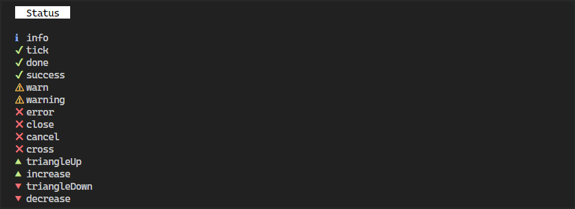

# Symbols

Unicode symbols for the terminal.

```
✔ ℹ ⚠ ✖ ☰ ↑ ↓ ← → ♪ ♫ ■ ● ․ … › ▲ ▴ ▼ ▾ ◂ ▸ ⌂ ♥ ↔ ↕ ≈ ≠ ≤ ≥ ≡ ∞ ෴ ★ ▶ ⬢
```

> Uses a fallback set of characters on terminals that do not support unicode.

## Usage

```ts
import { symbol, status } from 'https://.../symbols/mod.ts'

console.log(symbol.warning + " Are you sure?")  //  ⚠ Are you sure?
console.log(status.success, "Done") //  ✔ Done
console.log("Controls: ", symbol.arrowUp, symbol.arrowDown, symbol.arrowLeft, symbol.arrowRight) // Controls: ↑ ↓ ← →
```

## Status

<div align='center'>
    
</div>

## Links

Inspired by and heavily borrows from the following projects:

- https://github.com/sindresorhus/figures
